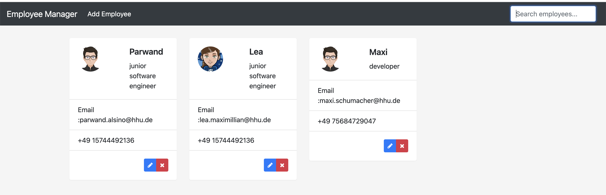

### To run Application
##### 1. create a database with docker-compose 
`docker-compose -f docker-compose.yml up -d`
##### 2. run server of spring application in backend
##### 3. Install angular CLI with node packe manager
`npm install -g @angular/cli`
##### 4. install package node_modules and run the app
`cd angular-app`  
`npm install --save-dev @angular-devkit/build-angular`  
`ng serve`

software engineer: [Parwand Alsino](https://www.parwand.net)
